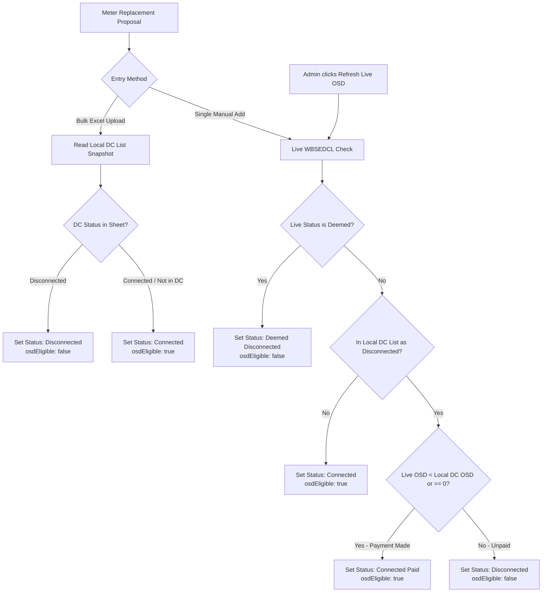

# Meter Replacement OSD & Disconnection Conflict Resolution Matrix

> **Document Updated:** 2026-08-21  
> **Topic:** OSD Delta Tracking ($\Delta \text{OSD}$), Deemed Disconnection Gates, and Multi-Source Conflict Resolution for Meter Replacement

---

## 1. The Core Operational Challenge

In WBSEDCL field operations, two data sources often provide conflicting statuses:
1. **Local Disconnection Module (`DC List`):** Field reality where an agency physically disconnected the consumer.
2. **WBSEDCL SAP WebDynpro Portal (`Live Check`):** Central billing system which often shows `"Connected"` because physical field disconnections take weeks or formal order execution to sync.

### Why We Cannot Rely on Simple Status Names
- If a consumer is physically disconnected with ₹5,000 OSD and has **not paid**, the live portal will still show `"Connected"`. Falsely relying on SAP's `"Connected"` word would incorrectly unlock meter issuance for a defaulter.
- Conversely, if the consumer was disconnected for ₹5,000, **went to the counter and paid**, their live OSD drops to ₹0 (or ₹1,200 due to a new billing cycle). Relying on the old static DC list `"Disconnected"` would unfairly block them.

---

## 2. The $\Delta \text{OSD}$ Payment Detection Formula

When a consumer is recorded as **`Disconnected`** in the local DC module, we mathematically detect whether a payment occurred by comparing the snapshot OSD against live OSD:

$$\text{Payment Occurred} = (\text{Live OSD} < \text{DC List OSD}) \ \mathbf{OR}\ (\text{Live OSD} == 0)$$

### Operational Scenarios:
1. **$\text{Live OSD} < \text{DC List OSD}$ (e.g. ₹1,500 < ₹5,000):**  
   The consumer paid the disconnection notice dues. The remaining amount is just the subsequent billing period. Reconnection is valid $\rightarrow$ **🟢 ELIGIBLE**.
2. **$\text{Live OSD} \ge \text{DC List OSD}$ (e.g. ₹5,000 or ₹7,500 $\ge$ ₹5,000):**  
   Zero payments have been made since disconnection. Physical cut remains active $\rightarrow$ **🔴 BLOCKED**.
3. **$\text{Live Status} == \text{"Deemed Disconnected"}$:**  
   Strict regulatory block $\rightarrow$ **🔴 BLOCKED** regardless of OSD values.
4. **$\text{Local Status} == \text{"Connected"}$:**  
   Active consumers with routine OSD (even ₹5k) are **🟢 ELIGIBLE** (policy: OSD alone on connected consumers does not block meter replacement).

---

## 3. Comprehensive Decision Matrix

| Local DC Status | Local DC OSD | Live Portal OSD | Live Portal Status | Condition Evaluation | Resolved Final Status | Meter Issuance | Rationale |
|---|---|---|---|---|---|---|---|
| **Disconnected** | ₹5,000 | ₹0 | Connected | $\text{Live} == 0$ | 🟢 **`Connected (Fully Paid)`** | **ALLOWED** | Consumer cleared all arrears (No Dues). |
| **Disconnected** | ₹5,000 | ₹1,500 | Connected | $\text{Live} < \text{DC List}$ | 🟢 **`Connected (Paid D/C Dues)`** | **ALLOWED** | Disconnection bill settled; balance is new cycle. |
| **Disconnected** | ₹5,000 | ₹5,000 | Connected | $\text{Live} == \text{DC List}$ | 🔴 **`Disconnected (Unpaid)`** | **BLOCKED** | No payment made since physical disconnection. |
| **Disconnected** | ₹5,000 | ₹7,200 | Connected | $\text{Live} > \text{DC List}$ | 🔴 **`Disconnected (Dues Accumulated)`** | **BLOCKED** | No payment made; arrears increased. |
| **Disconnected** | Any | Any | Deemed Disconnected | Live is Deemed | 🔴 **`Deemed Disconnected`** | **BLOCKED** | Explicit SAP Deemed Disconnection. |
| **Connected** | Any | Any | Connected | Live is Connected | 🟢 **`Connected`** | **ALLOWED** | Active consumer; OSD alone does not block. |
| **Connected** | Any | Any | Deemed Disconnected | Live is Deemed | 🔴 **`Deemed Disconnected`** | **BLOCKED** | SAP Deemed Disconnection overrides local list. |

---

## 4. End-to-End System Architecture



---

## 5. Implementation TypeScript Algorithm

```typescript
export interface OsdResolutionResult {
  isEligible: boolean
  resolvedStatus: 'Connected' | 'Connected (Fully Paid)' | 'Connected (Paid D/C Dues)' | 'Disconnected (Unpaid)' | 'Disconnected (Dues Accumulated)' | 'Deemed Disconnected'
  reason: string
}

export function resolveMeterReplacementEligibility(
  localDcStatus: string | undefined, // e.g. "disconnected" | "connected" | undefined
  localDcOsd: number,                // from DC list: d2NetOS numeric
  liveStatus: string,                // from live WBSEDCL: "Connected" | "Deemed Disconnected"
  liveOsd: number                    // from live WBSEDCL: totalDues
): OsdResolutionResult {
  // 1. Strict Deemed Disconnection Check
  if (liveStatus && liveStatus.toLowerCase().includes("deemed")) {
    return {
      isEligible: false,
      resolvedStatus: "Deemed Disconnected",
      reason: "Consumer is Deemed Disconnected on WBSEDCL portal."
    }
  }

  // 2. Conflict Resolution if Locally Disconnected
  if (localDcStatus && localDcStatus.toLowerCase() === "disconnected") {
    if (liveOsd === 0) {
      return {
        isEligible: true,
        resolvedStatus: "Connected (Fully Paid)",
        reason: "Consumer has cleared all outstanding dues (No Dues Certificate)."
      }
    }

    if (liveOsd < localDcOsd) {
      return {
        isEligible: true,
        resolvedStatus: "Connected (Paid D/C Dues)",
        reason: `Disconnection dues paid. Balance reduced from ₹${localDcOsd.toLocaleString("en-IN")} to ₹${liveOsd.toLocaleString("en-IN")}.`
      }
    }

    if (liveOsd === localDcOsd) {
      return {
        isEligible: false,
        resolvedStatus: "Disconnected (Unpaid)",
        reason: `Physical disconnection active. Dues unpaid (₹${liveOsd.toLocaleString("en-IN")}).`
      }
    }

    return {
      isEligible: false,
      resolvedStatus: "Disconnected (Dues Accumulated)",
      reason: `Physical disconnection active. Unpaid dues accumulated to ₹${liveOsd.toLocaleString("en-IN")}.`
    }
  }

  // 3. Active Connection Policy (OSD alone does not block)
  return {
    isEligible: true,
    resolvedStatus: "Connected",
    reason: "Connection is active."
  }
}
```
