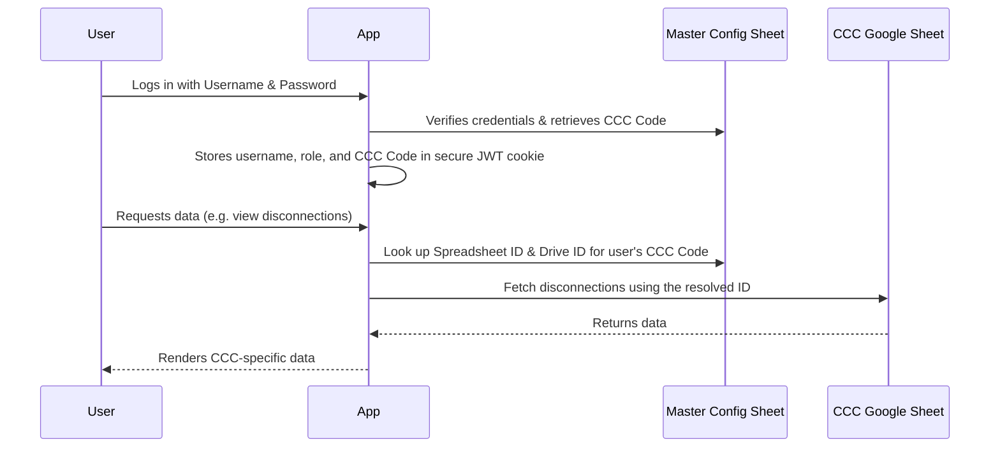
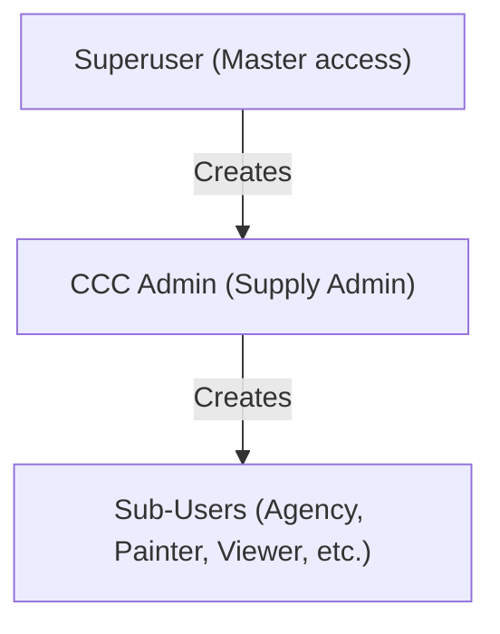

# Multi-Tenant Architecture Plan (Single-Domain Solution)

This document outlines the conceptual design for transforming the application into a single-domain, multi-tenant system. Currently, each Customer Care Center (CCC) runs a separate instance of the app with its own configuration. Under the new architecture, all CCCs will use the same hosted website, and the system will dynamically route data based on the logged-in user.

---

## 1. How It Works (The Core Flow)

Instead of hardcoding spreadsheet and folder IDs in a local configuration (`.env.local`), the app will dynamically look up these values after a user logs in.

---

## 2. Database & Config Structure

We will maintain one central **Master Config Spreadsheet** owned by the Superuser. This spreadsheet contains two primary tabs:

### Tab A: `CCC_Registry`
Maps each office to its respective Google Sheets and Google Drive locations.
| CCC Code | CCC Name | Disconnection Sheet ID | Google Drive Folder ID | Google Drive Refresh Token (Encrypted) |
| :--- | :--- | :--- | :--- | :--- |
| `CCC_01` | City Center | `1a2b3c4d5e...` | `folder_id_xyz...` | `refresh_token_123...` |
| `CCC_02` | North Suburb | `6f7g8h9i0j...` | `folder_id_abc...` | `refresh_token_456...` |

### Tab B: `Master_Credentials`
A single database of all users across all CCCs.
| Username | Password (Hashed) | Role | CCC Code | Name |
| :--- | :--- | :--- | :--- | :--- |
| `superadmin` | `hashed_pwd...` | `superuser` | `master` | Main Superuser |
| `city_admin` | `hashed_pwd...` | `admin` | `CCC_01` | City Admin |
| `city_agency` | `hashed_pwd...` | `agency` | `CCC_01` | City Agency |

---

## 3. User Role Hierarchy

### 1. Superuser
* **Scope**: Global (cross-CCC access).
* **Responsibilities**:
  * Registers new CCC offices in the system.
  * Inputs the CCC Code, Name, and Admin login.
  * Automatically creates a new spreadsheet copy for the new CCC.
  * Links the user's custom Google Drive Folder ID.

### 2. CCC Admin (Supply Admin)
* **Scope**: Scoped to their specific CCC (e.g., `CCC_01` only).
* **Responsibilities**:
  * Manages credentials for local sub-users (Agencies, Painters, Viewers).
  * Views reports, uploads master data, and handles approvals for their CCC.

### 3. Sub-Users (Agency, Painter, Viewer)
* **Scope**: Limited to tasks assigned to them within their CCC.

---

## 4. Automated Google Drive Linking (OAuth 2.0 Integration)

To eliminate the need for manual folder sharing and manual copying of folder IDs, we can implement an **automated OAuth 2.0 linking flow** for the CCC Admin:

### How it works:
1. **Interactive Link Prompt**:
   When a CCC Admin logs in for the first time, they see an onboarding card: 
   `⚠️ Google Drive Storage is not linked for this CCC. [Link Google Drive]`
2. **Authorize via Google OAuth**:
   Clicking the button redirects the Admin to Google's secure login screen where they log in with their office Google Account and grant permission to the app to access their files (specifically, files created by this app using the `https://www.googleapis.com/auth/drive.file` scope).
3. **Automatic Folder Provisioning**:
   * Google redirects the user back to the web application with an authorization code.
   * The app exchanges the code for access and refresh tokens.
   * Using the access token, the app automatically makes a Google Drive API call to create a folder named `Disconnection_Management_App_Storage_[CCC_Code]`.
4. **Seamless Registry Storage**:
   The app captures the newly created **Folder ID** and the **Refresh Token** (which is encrypted for security) and automatically writes both into the `CCC_Registry` sheet.

### Advantages of this approach:
* **No technical tasks for the Admin**: They do not need to share a folder manually, find the service account email, or copy/paste a Folder ID from the URL bar. It is completely automatic.
* **Separation of ownership**: The CCC office's Google account remains the absolute owner of the created folder, but the app can write to it indefinitely using the encrypted refresh token.

---

## 5. Automated Onboarding & Sheet Creation

When the Superuser registers a new CCC Admin:

1. **Automatic Template Copying**:
   The app will use the Google Drive API to make a copy of a master template spreadsheet (which contains all the formatted tabs like `Disconnection`, `NSC_Applications`, `Stock`, etc.).
2. **Naming & Ownership**:
   The new copy is automatically named `Disconnection_Management_App_[CCC_Code]` and shared with the CCC Admin's email so they can open it manually.
3. **Registry Linkage**:
   The program automatically retrieves the ID of this newly copied spreadsheet and writes it directly into the `CCC_Registry` tab of the Master Config Spreadsheet.
4. **Instant Readiness**:
   The new CCC Admin can immediately log in, add their local agency users, and start using the app. No code deployments or environment variable updates required!
