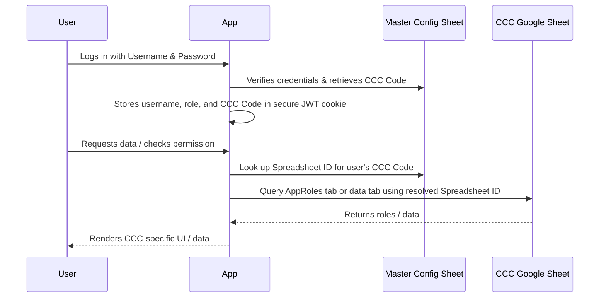
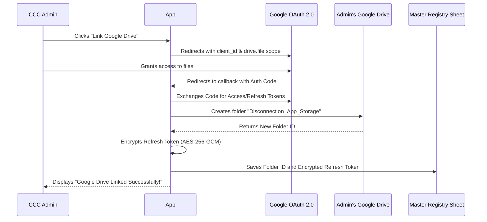

# Multi-Tenant Architecture Master Plan (Tenant-Specific Permissions)

This master plan details the transition of the application from a single-tenant configuration (environment-variable dependent) into a multi-tenant system. This architecture allows a single deployment to dynamically serve multiple Customer Care Centers (CCCs) based on the logged-in user, scaling to 300+ CCCs by clustering them across regional deployments.

Under this version, role permissions (`AppRoles`) are stored inside each CCC's individual spreadsheet, allowing each local office to customize its user permissions.

---

## 1. Prerequisites

Before writing code, the following assets and credentials must be established:

### A. Central Master Config Spreadsheet
A Google Spreadsheet owned by the Superuser with two tabs:
1. **`CCC_Registry`**:
   - Columns: `CCC Code`, `CCC Name`, `Disconnection Sheet ID`, `Google Drive Folder ID`, `Google Drive Refresh Token (Encrypted)`
2. **`Master_Credentials`**:
   - Columns: `Username`, `Password (Hashed)`, `Role`, `CCC Code`, `Name`

### B. Google Cloud OAuth Credentials
- A Google Cloud Project with the **Google Sheets API** and **Google Drive API** enabled.
- An **OAuth 2.0 Client ID and Secret** configured with the authorized redirect URI (e.g. `https://your-domain.vercel.app/api/auth/google/callback`).

### C. Security Encryption Secret
- A 32-byte hexadecimal encryption key (`ENCRYPTION_KEY`) added to Vercel environment variables to encrypt/decrypt OAuth refresh tokens stored in the spreadsheet.

---

## 2. Technical Challenges & Solutions

| Challenge | Impact | Architecture Solution |
| :--- | :--- | :--- |
| **Stateless API Routing** | Vercel Serverless API routes cannot read from `process.env` sheets. | Store `cccCode` in the encrypted JWT session cookie. The backend extracts `cccCode` on each request and looks up the active sheet ID. |
| **Tenant-Specific Roles** | Role permissions (`AppRoles`) must be configurable per tenant. | Refactor `RoleStorage` to accept `spreadsheetId` as a dynamic argument for all read/write/delete operations instead of using a static env variable. |
| **Google API Quotas** | 300 requests/minute limit would be shared globally, leading to rate limit errors. | Use **OAuth 2.0 dynamic linking**. Each CCC Admin links their own Google account, so write/upload actions run under their own user quota. |
| **Security of Tokens** | OAuth refresh tokens stored in Google Sheets could be compromised if read raw. | Encrypt the refresh tokens using Node's `crypto` module (AES-256-GCM) before writing them to `CCC_Registry`. |
| **Schema Variations** | Different CCCs might have slightly different column headers. | Maintain and expand the flexible header aliasing system (`COLUMN_MAPPINGS`) in `lib/google-sheets.ts`. |

---

## 3. Core Flow Diagrams

### Authentication & Tenant Resolution

### Drive OAuth Linking & Auto-Provisioning Flow

---

## 4. Implementation Checklist

### Phase 1: Security & Database Utilities
- [ ] Create `lib/encryption.ts` implementing `encrypt` and `decrypt` functions using AES-256-GCM.
- [ ] Create `lib/tenant-resolver.ts` to fetch and cache the `CCC_Registry` mappings (with a 5-minute cache to minimize master config reads).
- [ ] Add `cccCode` to the JWT payload in `lib/session.ts` and update session validation helpers.

### Phase 2: Dynamic API Routing & Dynamic Permissions
- [ ] Refactor `lib/role-storage.ts` to accept `spreadsheetId: string` in all public methods (`getRoles`, `getPermissionsForRole`, `addOrUpdateRole`, `deleteRole`).
- [ ] Refactor `lib/google-sheets.ts` to accept `spreadsheetId` dynamically instead of reading from `process.env.DISCONNECTION_SHEET`.
- [ ] Refactor `lib/consumer-master-service.ts` to resolve `spreadsheetId` dynamically for master lists.
- [ ] Update all GET/POST API routes (`/api/consumers`, `/api/consumer-master`, `/api/dtr`, etc.) and role management endpoints to:
  1. Extract `cccCode` from the session.
  2. Resolve the spreadsheet ID from `lib/tenant-resolver.ts`.
  3. Pass the spreadsheet ID to data-access functions.

### Phase 3: OAuth 2.0 & Auto-Provisioning
- [ ] Implement `/api/auth/google/login` redirecting admins to Google OAuth screen.
- [ ] Implement `/api/auth/google/callback` to handle token exchange.
- [ ] Write Google Drive folder provisioning helper to automatically create the app folder on the admin's drive and return the ID.
- [ ] Write spreadsheet template duplicator to copy the master template sheet when a new CCC is registered.

### Phase 4: Superuser & Admin Interface
- [ ] Create a **Superuser Dashboard** screen to:
  - Add new CCCs.
  - Create new CCC Admin accounts.
  - Track active tenant spreadsheets.
- [ ] Create an onboarding card inside the **Admin Panel** showing the OAuth connection status.

---

## 5. Data Migrations

### Step 1: Registry Initialization
Compile a mapping list of the 10 existing CCCs:
- Assign a unique code (e.g. `CCC_01`, `CCC_02`).
- Extract the Google Sheet IDs from their respective `.env` files.
- Write this list directly into the `CCC_Registry` tab.

### Step 2: Centralize User Credentials
Collect usernames and password hashes from the 10 local deployments:
- Populate the `Master_Credentials` tab.
- Set the correct `CCC Code` and `Role` for each user.

### Step 3: Historical Images
- Leave old images in their existing folders. All URL strings in Google Sheets pointing to these assets will continue to render perfectly.
